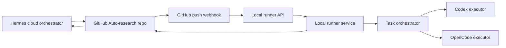

# Auto Research Local Runner Architecture

This repository implements a portable local service for the Hermes -> GitHub -> Codex/OpenCode research automation loop. It is designed to run on Windows and Linux with GitHub as the only durable task source.

## Components

## Responsibilities

Hermes plans research work, writes tasks and prompts to GitHub, reviews completed local work, and creates follow-up tasks.

GitHub stores `tasks/task_queue.json`, `prompts/`, code, logs, results, figures, and paper material. The local service always pulls from GitHub before executing and attempts to commit and push results after execution.

The local runner API exposes a narrow HTTP control plane. It can report health and status, list task summaries, return bounded task logs, trigger one fixed runner pass, and receive GitHub push webhooks.

Codex and OpenCode are invoked only by the local orchestrator after a task has been read from repository files. API callers cannot submit shell commands or prompts directly.

## Task State Machine

The task queue supports these states:

- `pending`: Hermes has published the task and local execution may claim it.
- `claimed`: a local runner has selected the task and recorded `claimed_by` and `claimed_at`.
- `running`: the local executor has started and `started_at` is recorded.
- `review`: local execution and quality checks completed; Hermes must review before `done`.
- `done`: Hermes or a human reviewer accepted the result.
- `failed`: local execution failed or retry budget was exhausted.
- `blocked`: human approval is required, such as hardware execution.
- `cancelled`: task was cancelled and must not run.

Local execution uses `pending -> claimed -> running -> review`. It never marks a task `done`.

## Safety Boundaries

The API is intentionally not a remote command service:

- No endpoint accepts arbitrary shell commands.
- No endpoint accepts arbitrary prompts for Codex/OpenCode.
- `/run-once` only starts `scripts/local_runner_service.py --once`.
- `/webhook/github` only accepts signed GitHub `push` events.
- Webhook path filtering only triggers on `tasks/`, `prompts/`, `project_state.json`, or `AGENTS.md`.
- `requires_human_approval=true` and `type=hardware_execution` tasks are marked `blocked`.
- `quality_checks` are restricted to `pytest` or `python -m pytest` command forms.
- A `logs/runner.lock` file prevents concurrent local runner executions.
- Stale runner locks are removed after a configurable timeout, defaulting to 24 hours.
- API token and webhook secret are read from environment variables and are never hard-coded.

## Review Loop

1. Hermes writes or updates a task in GitHub.
2. GitHub sends a signed push webhook, or Hermes calls `POST /run-once`.
3. The local API starts one runner pass if no runner is busy.
4. The runner pulls GitHub, claims one pending task, runs Codex/OpenCode, records logs and changed files, and marks the task `review`.
5. The runner commits and pushes local state.
6. Hermes reviews `review` tasks and marks them `done`, `failed`, or creates follow-up `pending` tasks.
